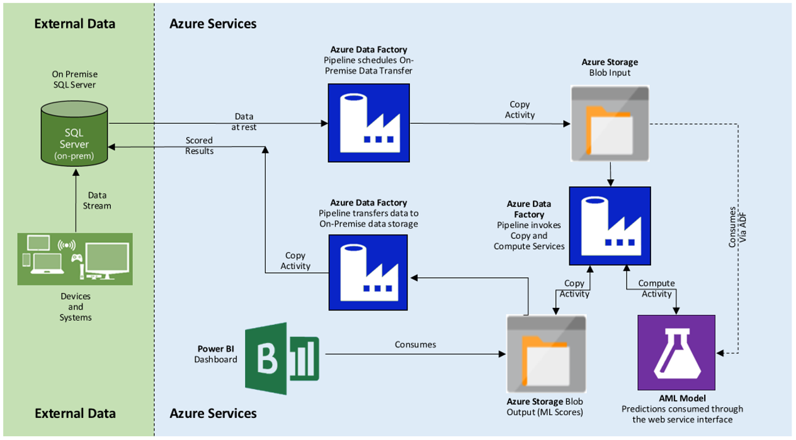
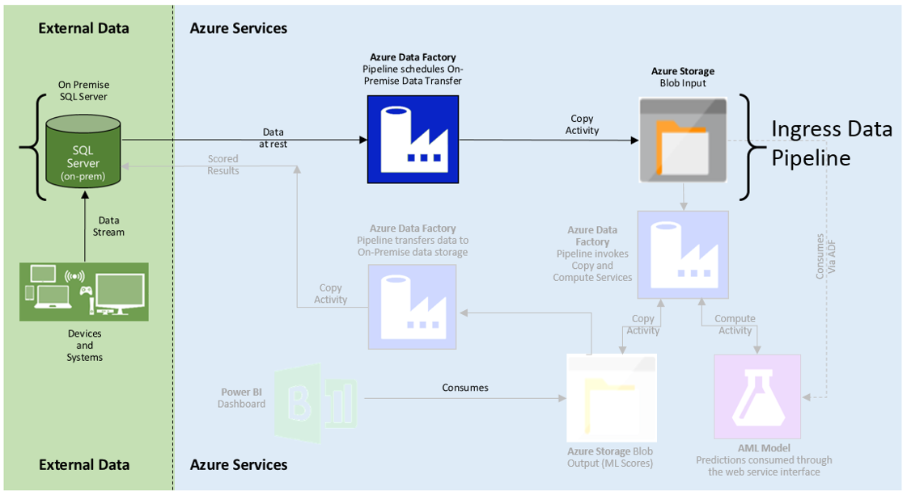
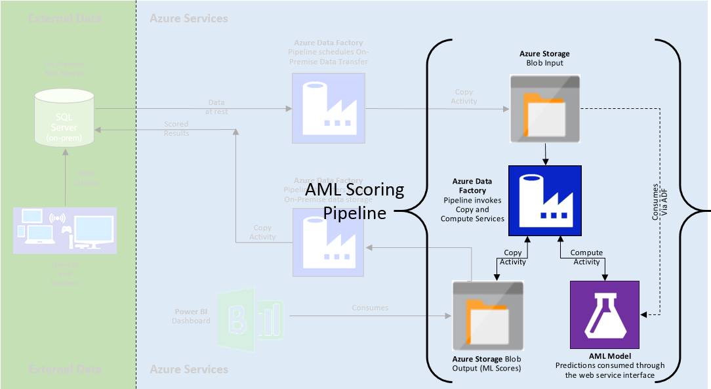
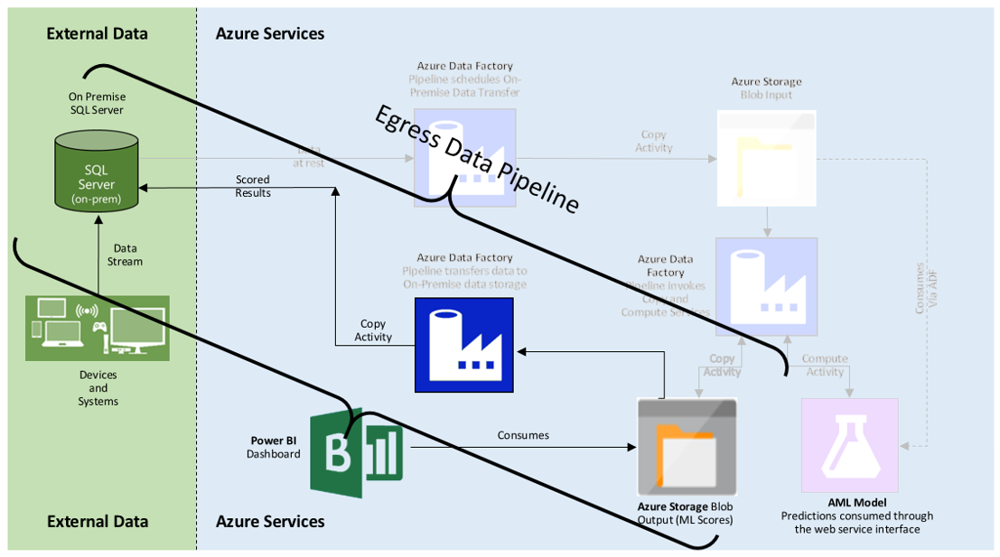

# Constructing On-Premise Data Pipeline in Azure for AML operationalization

Data driven decisions lie at the center of all fast growing companies. A
vast majority of companies use SQL servers for data storage,
aggregation, and number crunching. This data can also be used to
forecast machine breakdowns, detect anomalies, manage costs, etc. While
conventional data analytics can give very precise answers to static data
questions, it lacks the ability to predict trends, behaviors, or
anomalies in various processes, with continuously improving high degree
of accuracy. Machine learning fills this gap.

## Scope

This document helps you create an end-to-end (E2E) deployment ready data
pipeline for consuming an Azure Machine Learning (AML) solution for data
in your on-premise SQL server.

This document will describe the overall approach for operationalizing an
on-premise to Azure data pipeline through the following steps:

1.  An **Ingress data pipeline** that will bring in data from an
    on-premise SQL server to Azure Storage.

2.  An **AML data pipeline** to send data from Azure Storage to AML for
    batch scoring and then back to Azure Storage to store the
    scored results.

3.  An **Egress data pipeline** that will send the scores back to the
    on-premise SQL server from Azure Storage.

4.  Lastly, a **PowerBI dashboard** to visualize scoring results in
    real time.

By the end of this document you will be have a fully operationalized
data pipeline in Azure that is scheduled to run automatically on an
hourly basis.

## Prerequisites

1.  An active Azure Subscription. You also need to create an Azure
    Storage account.

2.  Access (read/write) to an on-premise SQL server.

3.  An existing pre-published AML model (we will create an
    operationalized ML solution using the BES endpoint of that model.
    You can get the sample experiment to go with this tutorial from this
    [link](http://gallery.cortanaanalytics.com/Experiment/17b8a753710c4bc3a9439297878e382c).

4.  Latest version of Azure PowerShell. To install PowerShell, follow
    the instructions
    [here](https://azure.microsoft.com/en-us/documentation/articles/powershell-install-configure/#Install).

## Big Picture

Building an Azure Machine Learning model requires historical data, and
perhaps lots of it based on the quality of the data. This is the reason
why it is important to think about building data pipelines not just for
building the model but also for getting scores from the model and
integrating the results with your current business processes. For our
current use case we have divided this pipeline into 3 discrete parts,
each serving a specific objective that can be tested separately if
desired. We start by giving you an overview of the big picture below.
Then we will briefly define various Azure platform services and tools we
will use. Finally, we will list step by step instructions you can follow
to create an E2E data pipeline.



<span id="_Ref414979332" class="anchor"></span> Figure : Overall
Architecture of E2E data pipeline for On-Premise data source

In the architecture shown above, we have two key consumer and producer
services – On-Premise SQL Server database and Azure Machine Learning
(AML) model. The on-premise database serves both as a data source and a
data sink. The AML model consumes the data hosted by the on-premise
database and produces prediction data that is copied back to the
on-premise database (consumer). We use Azure Data Factory (ADF) to move
the data between the on-premise database and Azure as well as for
calling the AML web service endpoint for scoring batches of input data.
You can read more about ADF and some of the ADF terminologies we will be
using
[here](https://azure.microsoft.com/en-us/documentation/articles/data-factory-introduction/).

The data pipeline is divided in to three section as follows:

i)  We use ADF to first copy data from an on-premise SQL Server to Azure
    Blob Storage (we will refer to this as the **IngressPipeline**).

ii) The ADF then invokes ‘compute’ activity using AML model’s BES
    endpoint for prediction and copies the predicted results to an
    output blob location (we will refer to this as the **AMLPipeline**).

iii) The scored data from the output blob location is then copied to the
    on-premise SQL server for integration with the rest of the business
    process (we will refer to this as the **EgressPipeline**).

We will also show how the scored results from section 2 can be
consumed through a PowerBI dashboard that is published in Azure cloud
and is available anywhere over the internet.

## Walkthrough

### Create an ADF and Setup Data Management Gateway

Make sure you have installed [Azure
PowerShell](http://azure.microsoft.com/en-us/documentation/articles/powershell-install-configure/#Install)
before continuing further. You will also require scripts from Ingress,
AML, and Egress pipeline folder that came with this document package.

1)  Open Azure PowerShell and switch mode to ARM

    PS C:\\&gt; Switch-AzureMode AzureResourceManager

2)  Add your Azure Subscription Account: PS C:\\&gt; Add-AzureAccount

    (This will open a pop up, enter your Azure subscription credentials here)

3)  Create a New Resource Group

```
    PS C:\\&gt; New-AzureResourceGroup -Name OnPremDataFactoryRG
-Location "West US"
```

4)  Create a New Data Factory under the resource group you just created

```
PS C:\\&gt; New-AzureDataFactory -ResourceGroupName
OnPremDataFactoryRG -Name OnPremDataFactory -Location "West US"
```

    (Note: ADF name needs to be globally unique)

5)  Create a Linked Service of type Data Management Gateway

```
PS C:\\&gt; New-AzureDataFactoryGateway -ResourceGroupName
OnPremDataFactoryRG -DataFactoryName OnPremDataFactory -Name
OnPremAzureDataGateway
```

At this point, you have created a resource group, a data factory and a
data gateway linked service to connect to an on-premise data management
gateway. We now need to register the linked service with the data
management gateway, follow section 4 - 10 under step 2 of this
[tutorial](http://azure.microsoft.com/en-us/documentation/articles/data-factory-use-onpremises-datasources/#step-1-create-an-azure-data-factory)
to install and configure the on-premise data management gateway before
returning to this document.

### Create Sample Input Data

Next, on an on-premise SQL Server create two tables, **InputSensorData**
and **ScoringResults**. Use the SQL scripts provided with this package
to create tables and insert sample data. InputSensorData table acts as
the input data source for the data pipelines and ScoringResults table
will hold the output from the Azure machine learning model.

### Create Data Pipelines

Finally, we will create 3 data pipelines (described earlier in this
document) all within the context of the ADF we just created. Each data
pipeline constitutes of at least one input dataset, one output dataset,
and an activity that transforms the input into the output. These
activities could be a simple (data) copy activity, a compute activity
(such as AML scoring), or some custom defined activity (such as ETL).

### Ingress On-Premise Pipeline



Figure : Ingress Pipeline

The Ingress pipeline connects your company’s on-premise SQL Server (in
your data center or lab) to Azure Cloud via the data management gateway
installed earlier. The ADF pipeline (shown in blue in the picture above)
itself will run a “copy activity” to copy the data between SQL server
database(s) and Azure Blob Storage.

1)  **Create Linked Services**: Each dataset (input or output) used in
    an ADF pipeline is backed by an underlying *linked service* that
    allows connection to the data store where the dataset resides. Each
    data store (storing input or output datasets for the ADF pipeline)
    must be uniquely defined as a new linked service. If both the input
    and the output datasets reside in the same data store (for example,
    the same blob container, or the same SQL database) then the same
    linked service can be used to connect to both input and
    output datasets.

    We will define **two linked services** – one to connect to your
    **on-premise database** and another to an **Azure blob storage**
    where your data is stored.

```
PS C:\\&gt; New-AzureDataFactoryLinkedService –ResourceGroupName
OnPremDataFactoryRG -DataFactoryName OnPremDataFactory -File
&lt;location of **OnPremSQLLinkedService** definition&gt;
```

    (Fill in the ConnectionString, gatewayName, username and password in
    the json definition file)

```
PS C:\\&gt; New-AzureDataFactoryLinkedService -ResourceGroupName
OnPremDataFactoryRG -DataFactoryName OnPremDataFactory -File
&lt;location of **BlobLinkedService** definition&gt;
```

    (Put in your Azure Storage AccountName and your AccountKey in the
    json definition file)

2)  **Create Input and Output Datasets**: Now having linked services
    defined, we can use them to create the *dataset* schema,
    partitioning and availability schedule. We will **define two
    datasets** – one that describes the schema and availability schedule
    of the table (containing input data) in your **on-premise database**
    and another that describes the partition, and schema and
    availability schedule for the **output blob store**.
```

PS C:\\&gt; New-AzureDataFactoryDataSet -ResourceGroupName
OnPremDataFactoryRG -DataFactoryName OnPremDataFactory -File
&lt;location of **InputOnPremSQLTable** definition&gt;

PS C:\\&gt; New-AzureDataFactoryDataSet -ResourceGroupName
OnPremDataFactoryRG -DataFactoryName OnPremDataFactory -File
&lt;location of **RawInputBlobTable** definition&gt;
```

3)  **Create Pipeline**: Finally, create an ADF pipeline that **connects
    the on-premise SQL server table to the Azure blob storage** defined
    above and invokes ***‘copy’ activity*** to be run every hour.

    PS C:\\&gt; New-AzureDataFactoryPipeline -ResourceGroupName
    OnPremDataFactoryRG -DataFactoryName OnPremDataFactory -File
    &lt;location of **IngressPipeline** definition&gt;

### The AML Scoring Pipeline



<span id="_Ref414987258" class="anchor"></span>Figure : AML Scoring
Pipeline

The AML scoring pipeline is shown in Figure 3. This pipeline connects to
the AML input blob location (**RawInputBlobTable**) and to the AML
output blob location (**ScoredOutputBlobTable**). Unlike the ingress
pipeline, the AML scoring pipeline runs a *compute* activity that calls
the AML web service batch execution endpoint, passes in the data from
AML input blob location as a batch to the web service, and writes the
results back to the AML output blob location.

1)  **Create Linked Service** to link your AML batch execution endpoint
    to the ADF pipeline.
```
PS C:\\&gt; New-AzureDataFactoryLinkedService -ResourceGroupName
OnPremDataFactoryRG -DataFactoryName OnPremDataFactory -File
&lt;location of **AMLLinkedService** definition&gt;
```

2)  **Create Output Dataset**: We will use the **RawInputBlobTable**
    from the Ingress Pipeline as an input dataset and define a new blob
    store dataset as the output of this pipeline.
```
PS C:\\&gt; New-AzureDataFactoryDataSet -ResourceGroupName
OnPremDataFactoryRG -DataFactoryName OnPremDataFactory -File
&lt;location of **ScoredOutputBlobTable** definition&gt;
```

3)  **Create Pipeline**: Finally, create an ADF pipeline that **connects
    input and output blob storages** and invokes
    **‘AMLBatchScoringActivity’** to be run every hour.

```
PS C:\\&gt; New-AzureDataFactoryPipeline -ResourceGroupName
OnPremDataFactoryRG -DataFactoryName OnPremDataFactory -File
&lt;location of **AMLPipeline** definition&gt;
```

### The Egress Pipeline



<span id="_Ref414988952" class="anchor"></span>Figure : Egress Pipeline

The two pipelines created so far bring the data into Azure for the AML
model and produce AML scores on an ongoing basis. This last pipeline
will allow you to copy the scored results back to your on-premise SQL
Server.

1)  **Create Output Dataset**: We will **use the *ScoredOutputBlobTable*
    from the *AML Scoring Pipeline* as an input** dataset **and define a
    new SQL table dataset (on-prem) as the output** of this pipeline. It
    is worth noting that you can choose a different SQL database to
    write the score results back. In that case you will need to define a
    new *Linked Service*, similar to the one we created in *Ingress
    Pipeline* connecting to the database storing the output
    dataset table.
```
PS C:\\&gt; New-AzureDataFactoryDataSet -ResourceGroupName
OnPremDataFactoryRG -DataFactoryName OnPremDataFactory -File
&lt;location of **OutputOnPremSQLTable** definition&gt;
```

2)  **Create Pipeline**: Finally, create an ADF pipeline that **connects
    your on-premise SQL server table to the Azure blob storage** to copy
    the scores back to your on-premise server.
```
PS C:\\&gt; New-AzureDataFactoryPipeline -ResourceGroupName
OnPremDataFactoryRG -DataFactoryName OnPremDataFactory –File
&lt;location of **EgressPipeline** definition&gt;
```

### Putting it all together - Activating the Pipeline

In the PowerShell run the following commands to start the three
pipelines for end to end ADF flow.

```
PS C:\\&gt; Set-AzureDataFactoryPipelineActivePeriod -ResourceGroupName
OnPremDataFactoryRG -DataFactoryName OnPremDataFactory *-*StartDateTime
&lt;2015-11-03T15:00:00&gt; –EndDateTime &lt;2015-11-07T21:45:00&gt;
–Name **IngressPipeline**

PS C:\\&gt; Set-AzureDataFactoryPipelineActivePeriod -ResourceGroupName
OnPremDataFactoryRG -DataFactoryName OnPremDataFactory -StartDateTime
&lt;2015-11-03T15:00:00&gt; –EndDateTime &lt;2015-11-07T21:45:00&gt;
–Name **AMLPipeline**

PS C:\\&gt; Set-AzureDataFactoryPipelineActivePeriod -ResourceGroupName
OnPremDataFactoryRG -DataFactoryName OnPremDataFactoryRG -StartDateTime
&lt;2015-11-03T15:00:00&gt; –EndDateTime &lt;2015-11-07T21:45:00&gt;
–Name **EgressPipeline**
```

(The pipelines are scheduled to run every hour; you can change the
frequency under the scheduler property in the json definition files.)

After you activate the pipelines you will see input data copied to Azure
blob, scored by AML, and finally AML scores available in your on-premise
SQL server every hour. The pipelines are activated sequentially so any
failure in one of the pipelines will stop the pipelines downstream from
running and producing garbled results.

### Visualizing the Results

The last and most important step in any solution operationalization is
to visualize and integrate the results back into your business process.
The egress pipeline discussed in the last step enables you to integrate
the machine learning predictions back into your on-premise SQL server.
Next we are going to create a dashboard in PowerBI to visualize the
results from the machine learning model.

#### Acquiring the data

Open up a new Excel workbook and click on the *Power Query* tab. If you
do not have a Power Query tab, install the plugin
[here](http://www.microsoft.com/en-us/download/details.aspx?id=39379)
(the plugin is already included as part of Excel 2016 – select **New
Query** under the Data tab) Follow the next few steps to add Azure blob
as a data model which is then uploaded to PowerBI dashboard.

-   Select ‘New Query’ -&gt; From Azure -&gt; From Microsoft Azure Blob
    Storage

-   Enter your blob storage account name (need to be globally unique)
    and keys. If you do not know these, you can get these from the Azure
    portal [here](https://portal.azure.com/).

-   If the credentials are entered correctly, you will see your blob
    container (“onprem”). Double-click on the container to open it in
    Query Editor.

-   In the editor window, click on “Binary” to load the actual data and
    then click on ‘Close & Load To’. Make sure the workbook queries tab
    on the right reports the correct number of rows for data.

-   In the dialog box that follows select “Only Create Connection” and
    click on the checkbox “Add this data to the Data Model”. This loads
    your data to the Excel workbook.

-   Save the Excel workbook.

#### Creating a Dashboard

Next we logon to the PowerBI webpage, create a new dashboard, and upload
Excel workbook we created in the last section containing the data from
the data model.

-   Visit the [Power BI webpage](https://msit.powerbi.com/) and click on
    the Get Data button on the bottom left corner.

-   Click the Get button under File and select and navigate to the
    storage location where you saved the workbook you created in the
    last step.

-   Double-click on the new dataset in the left pane; this opens up a
    report editor. You can select fields and visualization from the
    right pane. Save your report by clicking Save As under the
    File menu.

-   When you are done click on the pin icon () to
    pin the visualization to your dashboard. You can create a new
    dashboard or use an existing one.

-   You can share this dashboard with others by clicking on the share
    icon ().

#### Auto Refreshing Dashboards

In the last 2 sections we created a new dashboard and added
visualizations around the AML predictions data that is produced every
hour by the E2E pipeline we created earlier in this document. In this
section we will add a refresh schedule to the dashboard so that as the
new predictions become available from the pipeline, the dashboard
visualizations are updated automatically.

-   Right click on the newly added dataset in the left pane and select
    “*SCHEDULE REFRESH*”.

-   Under Data Source Credentials, enter your blob storage account key.

-   Now under “*Schedule Refresh*” click the ‘Keep your data up to date’
    button to Yes. Provide a schedule (daily for this tutorial) and
    hit apply.

-   The Visualization you pinned on your dashboard will be
    refreshed daily.
